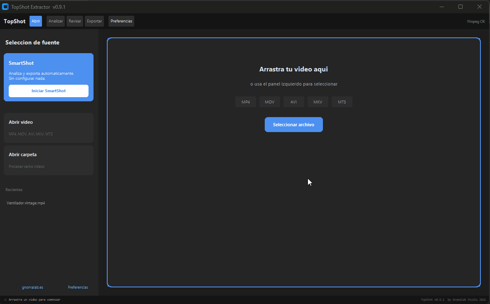

# TopShot

### Experimental Smart Frame Extractor for 3DGS & Photogrammetry

  

**by Gnomalab Studio 2026 — https://www.gnomalab.es**

---

⚠️ **TopShot is an experimental research tool.**
The architecture, heuristics and workflow design are under active development and may change significantly between versions.

The project is released publicly to document ongoing investigation into intelligent dataset preparation for 3D Gaussian Splatting, NeRF and photogrammetry pipelines.

---

## Concept

Dataset quality is one of the most critical — and least systematized — aspects of contemporary 3D reconstruction workflows.

TopShot explores automated frame selection as a **pre-curation layer** between raw video capture and spatial reconstruction processes.

Rather than being a finished production utility, the tool should be understood as a **methodological probe** into perceptual filtering, redundancy reduction and viewpoint stability.

---

## Filtering pipeline (current prototype)

Video input
↓
Frame decoding
↓
Blur filtering
↓
Motion stability estimation
↓
Duplicate detection
↓
Candidate dataset
↓
Manual visual review
↓
Export

Filtering heuristics are continuously evaluated and may evolve.

---

## Current filtering approach

| Filter                                                | Purpose                                          |
| ----------------------------------------------------- | ------------------------------------------------ |
| **Blur detection** (Laplacian variance)               | Reject frames with low spatial sharpness         |
| **Camera motion estimation** (Farneback optical flow) | Identify unstable viewpoints or excessive motion |
| **Duplicate detection** (Perceptual hash)             | Reduce temporal redundancy                       |

---

## Features (prototype stage)

* Automatic selection (Auto mode) or uniform distribution (Manual mode)
* IN/OUT trim zone for partial video analysis
* Visual filmstrip review with manual frame exclusion
* Optional ffmpeg acceleration (I-frame analysis)
* Full-resolution export in JPG or PNG
* SmartShot experimental full-pipeline mode
* Optional analysis report `.txt`

Interface behaviour and performance are still being refined.

---

## Known limitations

* Heuristic thresholds may not generalize across all capture conditions
* Large datasets may produce long analysis times
* GUI stability may vary depending on platform
* No batch processing yet
* No direct integration pipeline with reconstruction software

Feedback and testing reports are welcome.

---

## Installation

**Requirements:** Python 3.10+

pip install opencv-python numpy Pillow customtkinter tkinterdnd2

**Windows:** Double-click `Abrir_TopShot.bat` to install dependencies automatically.

**Mac / Linux:**
python topshot_extractor.py

### Optional — ffmpeg

Using ffmpeg allows faster pre-analysis by sampling I-frames.

---

## Usage (experimental workflow)

1. Load or drag a video
2. Optionally define an IN/OUT zone
3. Run analysis
4. Manually review selected frames
5. Export dataset

SmartShot mode attempts a fully automatic pass.

---

## Research roadmap

* Investigate exposure and color consistency metrics
* Explore overlap estimation strategies
* Evaluate ML-based frame ranking approaches
* Test dataset bias effects on 3DGS reconstruction quality
* Prototype batch processing logic
* Study integration possibilities with reconstruction environments

---

## License

MIT License — see LICENSE file.

---

## Credits

TopShot builds upon:

* OpenCV — https://opencv.org/
* ffmpeg — https://ffmpeg.org/
* CustomTkinter — https://github.com/TomSchimansky/CustomTkinter
* Pillow — https://python-pillow.org/
